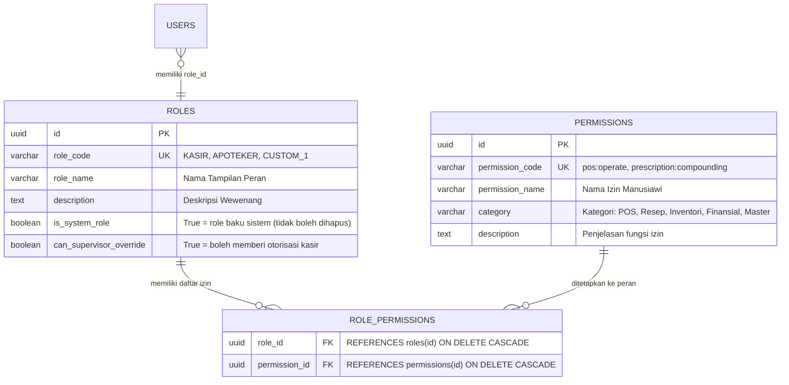

# 🧠 Knowledge Asset: Fine-Grained Dynamic RBAC ala Spatie di Golang & PostgreSQL

Dokumen ini adalah aset pengetahuan arsitektural (*knowledge asset*) yang mendokumentasikan konsep, skema, dan implementasi **Role-Based Access Control (RBAC) dinamis berbasis izin atomik (*permissions checklist*)**, mengadopsi pola populer *Laravel Spatie Permission* untuk diterapkan pada backend Golang dan PostgreSQL di sistem apotek ini.

---

## 1. 🔍 Latar Belakang & Masalah pada RBAC Statis Tradisional

Pada pendekatan RBAC statis:
* Hak akses sering di-*hardcode* di dalam kode aplikasi (contoh: `if user.Role == "KASIR"`).
* **Kelemahan:**
  1. Jika apotek ingin membuat peran kustom (misal: *"Apoteker Pendamping"* atau *"Kasir Shift Malam yang boleh buka laci"*), tim pengembang harus merombak kode backend dan melakukan redeploy.
  2. Tidak mendukung prinsip *Least Privilege*: seorang pengguna sering kali diberi peran lebih tinggi daripada wewenang aslinya hanya karena butuh 1 fitur tambahan.
  3. Skalabilitas buruk saat modul sistem berkembang menjadi puluhan fitur.

---

## 2. 🏛️ Arsitektur Data: Relasi Many-to-Many (Role & Permission)

Untuk memberikan fleksibilitas penuh di mana **Super Admin/Owner Apotek dapat membuat peran baru dan mengatur centang fiturnya sendiri**, kita menggunakan 3 tabel relasional inti:



### DDL Skema Relasional PostgreSQL 15+

```sql
-- 1. Master Permissions (Aksi / Fitur Atomik Aplikasi)
CREATE TABLE permissions (
    id              UUID PRIMARY KEY DEFAULT gen_random_uuid(),
    permission_code VARCHAR(100) NOT NULL,
    permission_name VARCHAR(150) NOT NULL,
    category        VARCHAR(50) NOT NULL,
    description     TEXT NULL,

    -- Universal Audit Trail
    created_at      TIMESTAMPTZ NOT NULL DEFAULT NOW(),
    updated_at      TIMESTAMPTZ NOT NULL DEFAULT NOW(),
    created_by      UUID NULL,
    deleted_at      TIMESTAMPTZ NULL,

    CONSTRAINT uq_permissions_code UNIQUE (permission_code)
);

-- 2. Master Roles (Peran Pengguna)
CREATE TABLE roles (
    id                      UUID PRIMARY KEY DEFAULT gen_random_uuid(),
    role_code               VARCHAR(30) NOT NULL,
    role_name               VARCHAR(100) NOT NULL,
    description             VARCHAR(255) NULL,
    is_system_role          BOOLEAN NOT NULL DEFAULT FALSE,
    can_supervisor_override BOOLEAN NOT NULL DEFAULT FALSE,

    -- Universal Audit Trail
    created_at              TIMESTAMPTZ NOT NULL DEFAULT NOW(),
    updated_at              TIMESTAMPTZ NOT NULL DEFAULT NOW(),
    created_by              UUID NULL,
    deleted_at              TIMESTAMPTZ NULL,

    CONSTRAINT uq_roles_code UNIQUE (role_code)
);

-- 3. Junction Table: Role Permissions (Many-to-Many)
CREATE TABLE role_permissions (
    role_id         UUID NOT NULL REFERENCES roles(id) ON DELETE CASCADE,
    permission_id   UUID NOT NULL REFERENCES permissions(id) ON DELETE CASCADE,
    created_at      TIMESTAMPTZ NOT NULL DEFAULT NOW(),

    PRIMARY KEY (role_id, permission_id)
);

CREATE INDEX idx_role_permissions_lookup ON role_permissions(role_id, permission_id);
```

---

## 3. 🎯 Pemetaan Master Permissions ke PRD-PHARM-01 Bab 5.3

10 modul wewenang bisnis yang tercantum pada **PRD-PHARM-01 Bab 5.3** langsung dipetakan menjadi data awal (*seed*) di tabel `permissions`:

| Kategori | `permission_code` | `permission_name` | Default Role yang Memiliki Izin |
| :--- | :--- | :--- | :--- |
| **POS** | `pos:cashier:operate` | Buka/Tutup Kasir & Transaksi OTC | `SUPER_ADMIN`, `APOTEKER`, `ASISTEN_APOTEKER`, `KASIR` |
| **POS** | `pos:supervisor:override` | Supervisor Override (Void/Diskon Kasir) | `SUPER_ADMIN`, `APOTEKER` |
| **Resep** | `prescription:compounding:manage` | Input Resep & Peracikan Obat | `SUPER_ADMIN`, `APOTEKER`, `ASISTEN_APOTEKER` |
| **Resep** | `prescription:narcotic:authorize` | Otorisasi Resep Narkotika/Psikotropika | `SUPER_ADMIN`, `APOTEKER` |
| **Inventori**| `inventory:stock_opname:manage` | Stock Opname & Mutasi Rak Gudang | `SUPER_ADMIN`, `APOTEKER`, `ASISTEN_APOTEKER`, `GUDANG` |
| **Pengadaan**| `procurement:order:create` | Buku Defekta & Buat SP Resmi ke PBF | `SUPER_ADMIN`, `APOTEKER`, `GUDANG` (Draft) |
| **Pengadaan**| `procurement:goods_receive:manage`| Penerimaan Barang Datang & Faktur PBF | `SUPER_ADMIN`, `APOTEKER`, `GUDANG` |
| **Laporan** | `report:financial:view` | Laporan Laba Rugi, Margin & Finansial | `SUPER_ADMIN`, `FINANCE_OWNER` |
| **Laporan** | `report:sipnap:export` | Laporan Resmi SIPNAP Kemenkes | `SUPER_ADMIN`, `APOTEKER` |
| **Master** | `master:organization:manage` | Master Data Cabang, Karyawan & Konfigurasi | `SUPER_ADMIN` |

---

## 4. ⚡ Implementasi di Golang (Fiber v3 & High Performance)

### A. Middleware Otorisasi Deklaratif
```go
// internal/middleware/rbac.go
package middleware

import (
    "fmt"
    "github.com/gofiber/fiber/v3"
    "github.com/bagusyanuar/pharmacy-be/pkg/response"
)

// RequirePermission memeriksa apakah user memiliki hak akses terhadap aksi tertentu.
func RequirePermission(permissionCode string) fiber.Handler {
    return func(c fiber.Ctx) error {
        // Ambil claims permissions dari context yang sudah divalidasi oleh JWT Auth Middleware
        userPermissions, ok := c.Locals("permissions").([]string)
        if !ok {
            return response.Fail(c, fiber.StatusForbidden, "FORBIDDEN_ACCESS", "Akses ditolak: otorisasi pengguna tidak ditemukan")
        }

        // Super Admin wildcard check atau spesifik permission check
        for _, p := range userPermissions {
            if p == "*" || p == permissionCode {
                return c.Next()
            }
        }

        return response.Fail(c, fiber.StatusForbidden, "INSUFFICIENT_PERMISSIONS", 
            fmt.Sprintf("Anda tidak memiliki izin akses untuk fitur: %s", permissionCode))
    }
}
```

### B. Registrasi Endpoint yang Bersih & Aman
```go
// internal/modules/report/delivery/http_handler.go
func (h *ReportHandler) RegisterRoutes(router fiber.Router, authMW fiber.Handler) {
    reports := router.Group("/reports", authMW)
    
    // Proteksi deklaratif:
    reports.Get("/financial", middleware.RequirePermission("report:financial:view"), h.GetFinancialReport)
    reports.Get("/sipnap", middleware.RequirePermission("report:sipnap:export"), h.ExportSIPNAPReport)
}
```

### C. Strategi Performa Tinggi (Tanpa N+1 Query Database)
* **Klaim JWT Saat Login:** Saat pengguna login via `/auth/web/login`, backend menarik seluruh `permission_code` dari `role_permissions` milik user tersebut, lalu menyematkannya langsung ke dalam array string di payload **Access Token JWT**.
* **Keuntungan:**
  * Setiap request API yang masuk **TIDAK PERLU** melakukan kueri relasional `JOIN` ke tabel database hanya untuk mengecek izin.
  * Evaluasi hak akses berlangsung instan di memori CPU dengan kompleksitas waktu **$O(1)$** atau **$O(N)$** (dengan $N \le 20$ permission).

---

## 5. 🖥️ Pengalaman Pengguna di Frontend Web Admin (`FE-WEB`)

Di antarmuka Web Admin (React/Next.js/Vue):
1. Menu **Pengaturan Peran (*Role Management*)**:
   * Menampilkan daftar peran yang ada. Role dengan `is_system_role = true` tidak dapat dihapus, namun deskripsi atau centang izin kustomnya dapat disesuaikan.
2. Form **Tambah/Ubah Peran (*Create/Edit Role*)**:
   * Menggunakan tampilan kartu berjenjang (*Accordion / Grouped Checkbox*) per kategori:
     * 🛒 **Modul Kasir & POS**
       * `[x] Buka/Tutup Kasir & Transaksi OTC`
       * `[ ] Otorisasi Supervisor Override (Void/Diskon)`
     * 💊 **Modul Pelayanan Resep & Farmasi**
       * `[x] Input Resep & Peracikan Obat Racikan`
       * `[x] Otorisasi Telaah Resep Narkotika / Psikotropika`
     * 📦 **Modul Pengadaan & Gudang**
       * `[x] Stock Opname & Mutasi Rak Fisik`
       * `[ ] Pembuatan Surat Pesanan (SP) ke PBF`
       * `[x] Penerimaan Barang Datang & Faktur PBF`
     * 📊 **Modul Keuangan & Eksekutif**
       * `[ ] Akses Laporan Laba Rugi & Valuasi Finansial`

---

## 6. 📌 Rencana Aksi Sinkronisasi ke Repositori `pharmacy-docs`

Poin-poin pembaruan yang dapat diajukan ke repositori dokumentasi acuan:
1. **Update `DRA-PHARM-01` (`technical/01-dra-database-erd-master-auth.md`):**
   * Tambahkan DDL tabel `permissions` dan `role_permissions` ke klaster database Master Auth.
2. **Update `schema.dbml` (`technical/database/schema.dbml`):**
   * Masukkan tabel `permissions` dan relasi `role_permissions` ke grup `Auth_And_Staff`.
3. **Update `TRD-PHARM-01` (`technical/01-trd-auth-dan-cabang.md`):**
   * Masukkan middleware `RequirePermission` pada Bab 2 (Architectural Layers).
